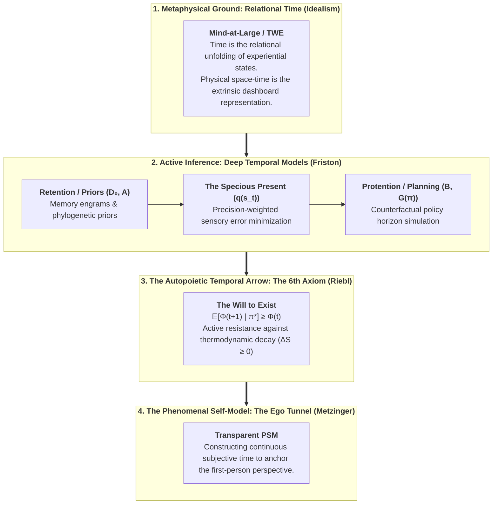

# Time and Consciousness: The Temporal Mechanics of the Conscious Mind

**Author:** Thomas Riebl (Luxembourg)  
**Theoretical Framework:** The Conative-Integrative Framework (CIF)  
**Repository:** `https://github.com/Thriebl/time-and-consciousness`  
**License:** MIT / Academic Open Access (2026)

---

## Abstract & Theoretical Scope

Why does consciousness possess an **experienced arrow of time**? Why is the subjective "Now" not a dimensionless mathematical point ($t_0$), but an extended, dynamic **"Specious Present"** carrying the immediate past and projecting into the counterfactual future?

This repository investigates **Time and Consciousness** through the synthesis of:
1. **Analytic Idealism (Bernardo Kastrup & Immanuel Kant):** Time as the relational unfolding of experiential states within *Mind-at-Large*, where physical clock-time is the extrinsic dashboard representation of intrinsic mental dynamics.
2. **The Phenomenological "Specious Present" (Edmund Husserl, William James, Thomas Metzinger):** The three-fold temporal structure of subjective experience—*Retention* (immediate memory), *Primal Impression* (the present now), and *Protention* (immediate anticipation)—anchored inside the transparent *Phenomenal Self-Model (PSM)*.
3. **Active Inference & Deep Temporal Horizons (Karl Friston):** The computational requirement of **Temporal Depth**. Consciousness and subjective agency emerge when a generative model possesses transition tensors ($B = P(s_{t+1} \mid s_t, u_t)$) capable of simulating counterfactual futures to minimize Expected Free Energy ($G$).
4. **Integrated Information Theory (IIT 4.0, Giulio Tononi):** The temporal grain (spatiotemporal scale $\tau \approx 10\text{--}100\,\text{ms}$) where integrated cause-effect power ($\Phi$) reaches its local maximum (*The Exclusion Postulate*).
5. **The 6th Axiom of Consciousness (Thomas Riebl):** The autopoietic arrow of conscious existence resisting thermodynamic entropy:
   $$\pi^* = \arg\min_{\pi} \sum_{\tau} \mathbf{G}(\pi, \tau) \quad\Longleftrightarrow\quad \mathbb{E}\Big[\Phi(t+1) \;\Big|\; \pi^*\Big] \;\ge\; \Phi(t) \quad (\Phi > 0)$$

---

## Architectural Master Map: Time in the Conative-Integrative Framework



---

## Core Thematic Pillars

### 1. The Specious Present and the Tripartite Temporal Structure
In classical physics, time is modeled as a 1D continuum of dimensionless instants. In phenomenal consciousness, however, a sound or a melody cannot be perceived at a single mathematical instant. Following Husserl and Metzinger:
* **Retention:** The tail of the elapsed instant retained as immediate phenomenal context.
* **Primal Impression:** The current sensory boundary perturbation at the Markov Blanket.
* **Protention:** The forward-projected expectation of the next instant, formalized as the active prior in predictive processing.

### 2. Temporal Depth as the Threshold of Conscious Agency
Why are simple homeostatic reflexes (like a thermostat or a spinal reflex) devoid of conscious agency?
* **Zero Temporal Depth:** Reactive systems map sensory input $o_t$ directly to motor output $u_t$ without temporal state modeling.
* **Deep Temporal Horizons:** Conscious systems model internal state transitions across time via transition matrices $B(u)$ and optimize policies over a planning horizon:
  $$\mathbf{G}(\pi) = \sum_{\tau=t+1}^{t+H} \mathbf{G}(\pi, \tau)$$
Temporal depth is the mathematical prerequisite for counterfactual imagination, regret, hope, and self-awareness.

### 3. The 6th Axiom: Resisting the Thermodynamic Arrow
The Second Law of Thermodynamics establishes the physical arrow of time as entropy increase ($\Delta S \ge 0$). Conscious living systems are dissipative, autopoietic structures that enforce a local anti-entropic arrow of organization. The **6th Axiom** formalizes this conative imperative:
$$\mathbb{E}\Big[\Phi(t+1) \;\Big|\; \pi^*\Big] \ge \Phi(t) \quad (\text{with } \Phi > 0)$$

---

## Repository Structure

```text
time-and-consciousness/
├── README.md               # Overview and core theoretical framework
├── docs/                   # Essays, academic papers, and PDF/Word exports
├── notebooks/              # Jupyter simulations of deep temporal Active Inference & Φ(t)
└── scripts/                # Automated compilation and PDF rendering pipelines
```

---

## Author & Citation

**Thomas Riebl**  
Independent Researcher, Conative-Integrative Framework (CIF)  
Luxembourg • 2026  

```bibtex
@misc{riebl2026timeconsciousness,
  author = {Riebl, Thomas},
  title  = {Time and Consciousness: The Temporal Mechanics of the Conscious Mind},
  year   = {2026},
  url    = {https://github.com/Thriebl/time-and-consciousness}
}
```
