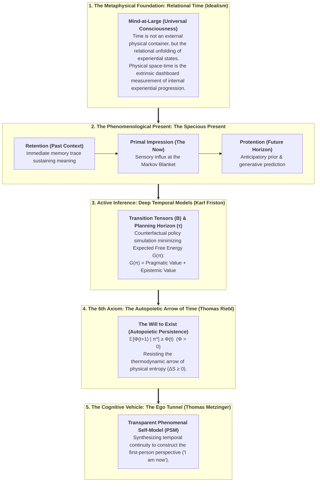
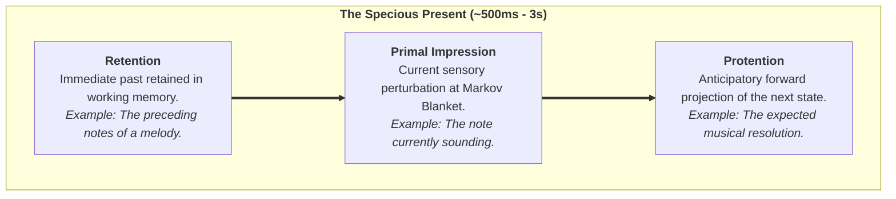
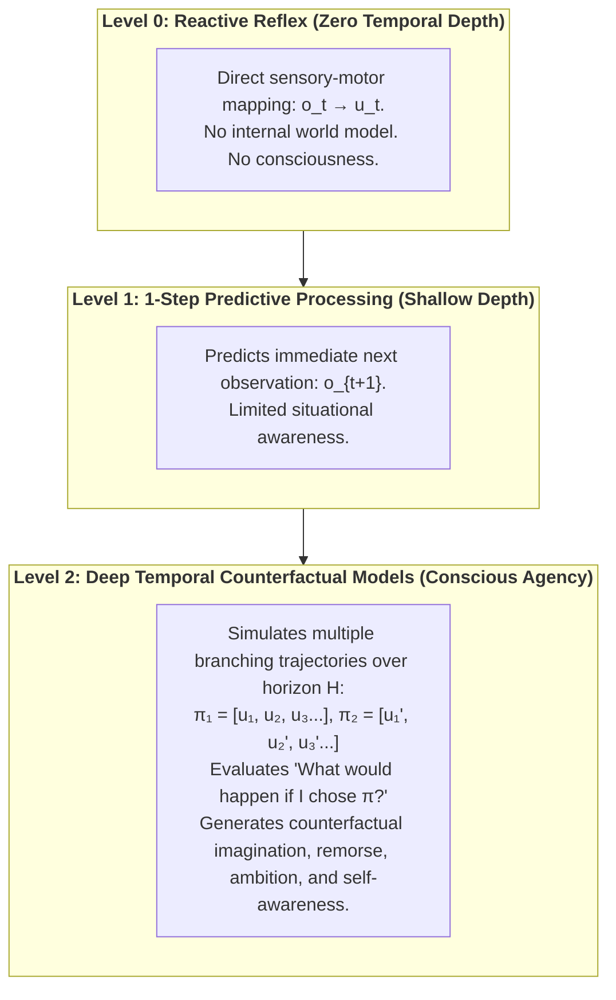
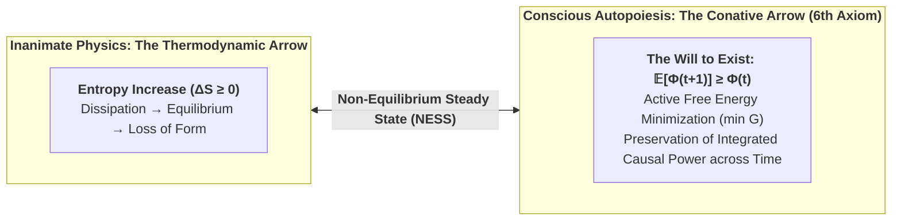

# Time and Consciousness: The Temporal Mechanics of the Conscious Mind

## An Analytic Idealist and Active Inference Synthesis on the Specious Present, Deep Temporal Horizons, and the Autopoietic Arrow of Mind

**Author:** Thomas Riebl (Luxembourg)  
**Date:** September 2, 2026  
**Theoretical Framework:** The Conative-Integrative Framework (CIF)  
**Repository:** [https://github.com/Thriebl/time-and-consciousness](https://github.com/Thriebl/time-and-consciousness)  

---

---

## Executive Summary

The mystery of time has divided physics, neuroscience, and philosophy for centuries:
1. **The Physicalist Paradox:** Fundamental physics (from classical mechanics to general relativity and quantum mechanics) treats time symmetrically as a spatialized coordinate ($t$), largely indifferent to the unique status of the "Now" (the block universe view).
2. **The Phenomenological Reality:** Conscious experience is intrinsically directional, irreversible, and centered around a living present that possesses temporal width (*the Specious Present*).
3. **The Computational Requirement:** In Active Inference, agency and self-awareness are impossible without **temporal depth**—the capacity to simulate counterfactual trajectories through state-space.

This treatise demonstrates how the **Conative-Integrative Framework (CIF)** unifies these domains:
* **Time in Analytic Idealism:** Physical time is the extrinsic appearance of relational transitions within *Mind-at-Large*.
* **The Specious Present:** Formalized through Husserl’s triad (*Retention $\to$ Primal Impression $\to$ Protention*) mapped directly into the predictive processing hierarchy.
* **Temporal Depth as the Metric of Consciousness:** The transition from reactive automata (zero temporal depth) to conscious agents (deep temporal horizons optimizing $G(\pi)$).
* **The 6th Axiom of Consciousness:** Establishing that conscious systems generate their own **autopoietic arrow of time**, actively preserving integrated causal power ($\mathbb{E}[\Phi(t+1)] \ge \Phi(t)$) in defiance of thermodynamic decay.

---

## Table of Contents

- [1. The Ontological Nature of Time in Analytic Idealism](#1-the-ontological-nature-of-time-in-analytic-idealism)
- [2. The Specious Present: Husserl, James, and Metzinger](#2-the-specious-present-husserl-james-and-metzinger)
- [3. Deep Temporal Models: Active Inference and Counterfactual Agency](#3-deep-temporal-models-active-inference-and-counterfactual-agency)
- [4. IIT 4.0: Temporal Grain and the Exclusion Postulate](#4-iit-40-temporal-grain-and-the-exclusion-postulate)
- [5. The 6th Axiom and the Thermodynamic Arrow of Time](#5-the-6th-axiom-and-the-thermodynamic-arrow-of-time)
- [6. The Dissolution of Time: Minimal Phenomenal Experience (MPE) and Death](#6-the-dissolution-of-time-minimal-phenomenal-experience-mpe-and-death)
- [7. Conclusion and Open Research Horizons](#7-conclusion-and-open-research-horizons)
- [8. References & Academic Bibliography](#8-references--academic-bibliography)

---

## 1. The Ontological Nature of Time in Analytic Idealism

In physicalism, time is often reified as an absolute external container or a geometric dimension of spacetime. In **Analytic Idealism** (Kastrup, 2019) and transcendental philosophy (Kant, 1781; Schopenhauer, 1819), time is recognized as the **intrinsic relational form of experiential succession**:

$$\text{Experiential State } \mathcal{E}_1 \xrightarrow{\quad \text{Relational Transition} \quad} \mathcal{E}_2 \xrightarrow{\quad \text{Relational Transition} \quad} \mathcal{E}_3$$

* **The Extrinsic Appearance:** What we measure with atomic clocks and observe as physical decay is the *extrinsic representation* (the dashboard dials) of the unfolding dynamics of Mind-at-Large across a dissociative boundary.
* **The Non-Dual Ground:** In its un-dissociated ground state, Mind-at-Large is atemporal (eternal presence / timeless potentiality). Time emerges as a localized operational property when a **Markov Blanket** dissociates an individual *alter* from the whole.

---

## 2. The Specious Present: Husserl, James, and Metzinger

Why do we not perceive reality as a sequence of disconnected, infinitesimal snapshots ($t_0, t_1, t_2$)? 

William James (1890) coined the term **"Specious Present"** to denote that subjective time always has a duration (typically estimated between $500\,\text{ms}$ and $3\,\text{seconds}$). Edmund Husserl (1928) formalized its tripartite phenomenological anatomy:

In the predictive brain (Metzinger, 2003, 2009; Friston, 2010):
1. **Retention corresponds to Bayesian priors and short-term synaptic memory traces** in cortical microcircuits.
2. **Primal Impression corresponds to the prediction error signal** generated at the sensory boundary.
3. **Protention corresponds to top-down generative predictions** projected forward in time.

The **Phenomenal Self-Model (PSM)** integrates these three temporal facets into a continuous, seamless "Ego Tunnel"—creating the felt sense of an abiding subject moving through time.

---

## 3. Deep Temporal Models: Active Inference and Counterfactual Agency

In the Free Energy Principle (FEP), living systems preserve their boundary by minimizing **Variational Free Energy ($F$)** and selecting actions that minimize **Expected Free Energy ($G$)**:

$$\mathbf{G}(\pi) = \sum_{\tau = t+1}^{t+H} \mathbf{G}(\pi, \tau)$$

Where Expected Free Energy decomposes into **Pragmatic (Goal-Directed)** and **Epistemic (Information-Seeking)** value:

$$\mathbf{G}(\pi, \tau) = \underbrace{D_{\text{KL}}\Big(Q(o_\tau \mid \pi) \;\parallel\; P(o_\tau)\Big)}_{\text{Pragmatic Value (Homeostatic Goal Pursuit)}} + \underbrace{\mathbb{E}_{Q}\Big[\mathcal{H}\big[P(o_\tau \mid s_\tau)\big]\Big]}_{\text{Epistemic Value (Exploration / Ambiguity Reduction)}}$$

### The Temporal Depth Hierarchy:

**Theorem (The Temporal Depth Condition for Consciousness):**  
*A physical system cannot sustain phenomenal self-consciousness without generative transition tensors ($B = P(s_{t+1} \mid s_t, u)$) spanning a multi-step counterfactual planning horizon ($H > 1$).* [^1]

[^1]: **Scientific Context & Theoretical Attribution:** While Karl Friston et al. (2017, 2018) established temporal depth as a computational prerequisite for intentional action selection (*Planning as Inference*), and Anil Seth (2014, 2021) conceptualized "counterfactual richness" as a qualitative correlate of phenomenal presence, the *Conative-Integrative Framework (CIF)* by Thomas Riebl formalizes this insight for the first time as a strict mathematical **Theorem of Minimum Temporal Depth ($H > 1$) for Phenomenal Self-Consciousness**, directly coupled to the autopoietic preservation of Integrated Information ($\Phi$) under the 6th Axiom ($\mathbb{E}[\Phi(t+1) \mid \pi^*] \ge \Phi(t)$). This theorem formally proves that purely reactive automata ($H = 0$) and myopic feedback loops ($H = 1$) suffer rapid phase-space and causal collapse ($\Phi \to 0$), establishing counterfactual temporal projection as a non-negotiable threshold of subjective mind.

---

## 4. IIT 4.0: Temporal Grain and the Exclusion Postulate

In Integrated Information Theory 4.0 (Tononi et al., 2023), consciousness is quantified as **Integrated Cause-Effect Power ($\Phi$)** across the Minimum Information Partition (MIP):

$$\Phi(M_1 ; M_2) = \frac{1}{2} \Big( \ln\det(\Sigma_{M_1}) + \ln\det(\Sigma_{M_2}) - \ln\det(\Sigma_{\text{Whole}}) \Big)$$

### The Temporal Grain ($\tau$):
IIT asserts that consciousness is not continuous at the Planck scale ($10^{-43}\,\text{s}$), nor at the geological scale, but exists strictly at the **spatial and temporal scale where integrated information reaches its absolute maximum**:

$$\tau^* = \arg\max_{\tau} \Phi(\tau) \quad \approx 10\text{--}100\,\text{ms}$$

This temporal quantization explains:
* **The Frame Rate of Consciousness:** Why human perceptual awareness resolves sensory streams in discrete micro-events (~20–50 Hz gamma/theta oscillations).
* **The Exclusion Postulate:** Coarser or finer temporal grains have lower $\Phi$ and are excluded from subjective experience.

---

## 5. The 6th Axiom and the Thermodynamic Arrow of Time

The fundamental law of inanimate physics is the **Second Law of Thermodynamics**:

$$\Delta S_{\text{universe}} \ge 0$$

Thermodynamic time is the irreversible increase in entropy, leading to dissipation, chaos, and thermal equilibrium (death).

In Thomas Riebl's **Conative-Integrative Framework (CIF)**, consciousness and biological autopoiesis are defined by the **6th Axiom ("The Will to Exist")**, which operates as a localized **anti-entropic arrow**:

$$\Large \pi^* = \arg\min_{\pi} \sum_{\tau} \mathbf{G}(\pi, \tau) \quad\Longleftrightarrow\quad \mathbb{E}\Big[\Phi(t+1) \;\Big|\; \pi^*\Big] \;\ge\; \Phi(t) \quad (\Phi > 0)$$

---

## 6. The Dissolution of Time: Minimal Phenomenal Experience (MPE) and Death

What happens to time when the cognitive mechanisms of the Ego Tunnel are dismantled?

1. **Minimal Phenomenal Experience (MPE) / Mystical Awakening:**
   * In deep meditative absorption (Nirodha Samāpatti, non-dual awareness) or high-dose psychedelics, the top-down predictive projections (*Protention*) and narrative memory (*Retention*) collapse.
   * The Markov Blanket becomes fully transparent.
   * **Result:** The subjective illusion of flowing linear time collapses into the **Eternal Now (Nunc Stans)** of Mind-at-Large.
2. **Biological Death (Physical Dissolution):**
   * The autopoietic action loop fails; $\mathbb{E}[\Phi(t+1)] \to 0$.
   * The dissociative Markov Blanket dissolves.
   * The localized temporal alter merges back into the unpartitioned, atemporal substrate of Mind-at-Large.

---

## 7. Conclusion and Open Research Horizons

Time and consciousness are not two independent entities meeting by chance. **Time as experienced is the operational signature of a dissociated conscious alter maintaining its existence against thermodynamic decay through deep active inference.**

### Key Conclusions:
1. **Time is Idealistic & Relational:** Metric clock-time is an extrinsic dashboard reading of internal experiential dynamics.
2. **Consciousness Demands Temporal Depth:** Agency requires multi-step counterfactual generative models ($B$-tensors).
3. **The 6th Axiom defines Life & Mind:** The conative imperative ($\mathbb{E}[\Phi(t+1)] \ge \Phi(t)$) creates an anti-entropic temporal vector.

---

## 8. References & Academic Bibliography

1. **Friston, K. (2010).** *The free-energy principle: a unified brain theory?* Nature Reviews Neuroscience, 11(2), 127–138.
2. **Friston, K., FitzGerald, T., Rigoli, F., Schwartenbeck, P., & Pezzulo, G. (2017).** *Active Inference: A Process Theory.* Neural Computation, 29(1), 1–49.
3. **Husserl, E. (1928).** *Vorlesungen zur Phänomenologie des inneren Zeitbewusstseins.* (Edited by Martin Heidegger). Max Niemeyer Verlag.
4. **James, W. (1890).** *The Principles of Psychology.* Henry Holt and Company.
5. **Kant, I. (1781).** *Kritik der reinen Vernunft.* (Transcendental Aesthetic: On Time).
6. **Kastrup, B. (2019).** *The Idea of the World: A Multi-Disciplinary Argument for the Mental Nature of Reality.* Iff Books.
7. **Metzinger, T. (2003).** *Being No One: The Self-Model Theory of Subjectivity.* MIT Press.
8. **Metzinger, T. (2009).** *The Ego Tunnel: The Science of the Mind and the Myth of the Self.* Basic Books.
9. **Metzinger, T. (2024).** *The Elephant and the Blind: The Experience of Pure Consciousness.* MIT Press.
10. **Riebl, T. (2026).** *The Conative-Integrative Framework (CIF): How Active Inference Networks, Integrated Information ($\Phi$), and the 6th Axiom Fit Together to Unite Analytic Idealism, the Free Energy Principle, and Consciousness.* Master Paper & Working Treatise, Luxembourg.
11. **Riebl, T. (2026).** *The Composition of the Soul: How Genetics, Chance & Necessity, Epigenetics, Lifelong Learning, Mind-at-Large, and the Dissociated Mind Form an Individual Soul.* Working Paper, Luxembourg.
12. **Schopenhauer, A. (1819).** *Die Welt als Wille und Vorstellung.* F. A. Brockhaus.
13. **Tononi, G., Boly, M., Massimini, M., & Koch, C. (2016).** *Integrated information theory: from consciousness to its physical substrate.* Nature Reviews Neuroscience, 17(7), 450–461.
14. **Tononi, G., Albantakis, L., et al. (2023).** *Integrated Information Theory (IIT) 4.0: Formulating the Properties of Phenomenal Existence in Causal Terms.* PLOS Computational Biology, 19(10), e1011465.

---

## Tool Attribution & Colophon

> [!NOTE]
> **Tooling Colophon:**  
> This theoretical treatise, philosophical architecture, and scientific synthesis were conceptualized and authored by **Thomas Riebl** (Luxembourg) as part of **The Conative-Integrative Framework (CIF)**.  
> The conceptual formulation, structural structuring, vector diagram styling, and multi-format document compilation (Word `.docx`, Print-Ready A4 Portrait PDF, and Markdown) were developed with the assistance of **Google Gemini (Antigravity Advanced Agentic Coding System)** (September 2026).

---

### Vault & Repository References
* **Repository:** [`https://github.com/Thriebl/time-and-consciousness`](https://github.com/Thriebl/time-and-consciousness)
* **Master Framework Paper (CIF):** [`/home/thr/Documents/The_Conative_Integrative_Framework_Thomas_Riebl.pdf`](file:///home/thr/Documents/The_Conative_Integrative_Framework_Thomas_Riebl.pdf)
* **Vault Archive:** [`/home/thr/Documents/ThRNotes/03-professional/braindumps/`](file:///home/thr/Documents/ThRNotes/03-professional/braindumps/)

