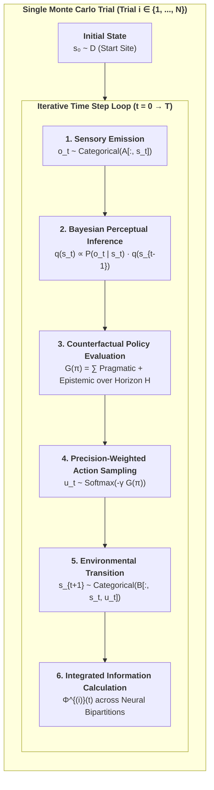
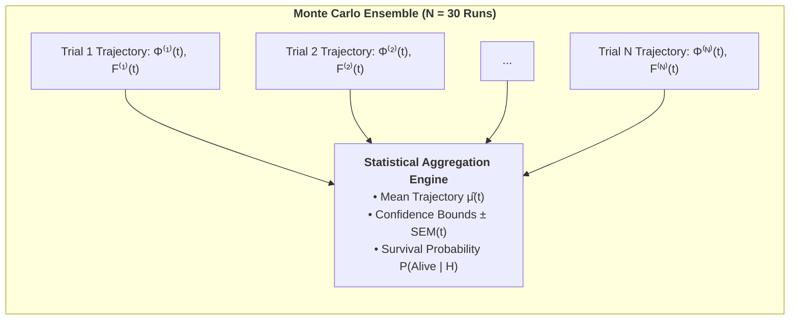

# Monte Carlo Methodology in Active Inference and Consciousness Research
## Statistical Sampling of Stochastic Phase Spaces, Temporal Depth, and the 6th Axiom

**Author:** Thomas Riebl (Luxembourg)  
**Theoretical Framework:** The Conative-Integrative Framework (CIF)  
**Repository:** [https://github.com/Thriebl/time-and-consciousness](https://github.com/Thriebl/time-and-consciousness)  
**Date:** September 3, 2026  

---

## Executive Summary

In computational neuroscience, predictive processing, and Integrated Information Theory (IIT 4.0), evaluating an agent's cognitive capabilities cannot rely on a single deterministic trajectory. Biological organisms and synthetic active inference agents operate in intrinsically stochastic, partially observable environments characterized by:
1. **Sensory observation noise** ($A = P(o \mid s)$),
2. **Transition uncertainty and environmental hazards** ($B = P(s_{t+1} \mid s_t, u)$),
3. **Exploratory policy sampling** ($\pi^* \sim \sigma(-\gamma \mathbf{G})$).

To scientifically prove that **Temporal Depth ($H > 1$)** and the **6th Axiom of Autopoietic Causal Persistence** ($\mathbb{E}[\Phi(t+1) \mid \pi^*] \ge \Phi(t)$) are non-negotiable structural requirements for conscious agency, our simulation framework employs **Monte Carlo Ensemble Sampling** across independent trial cohorts ($N = 30 \dots 1000$).

This document provides a comprehensive theoretical and mathematical breakdown of what a **Monte Carlo Trial** is in our simulation, how it executes step-by-step, and why it is indispensable for validating theories of consciousness.

---

## 1. What is a Monte Carlo Trial in Active Inference?

A **Monte Carlo Trial** is an independent, end-to-end realization of an agent's interaction loop with a stochastic POMDP (Partially Observable Markov Decision Process) over a finite time horizon $T \in [0, T_{\max}]$.

In each individual trial $i \in \{1, \dots, N\}$, random noise perturbs sensory inputs, action choices, and transition dynamics. By aggregating across an ensemble of $N$ trials, we compute unbiased empirical estimators for:
* **The Expected Trajectory of Integrated Information:** $\widehat{\mathbb{E}}[\Phi(t)]$,
* **The Autopoietic Survival Probability:** $\widehat{P}(\text{Survival} \mid H)$,
* **The Variational Free Energy Profile:** $\widehat{\mathbb{E}}[F(t)]$.

---

## 2. Step-by-Step Anatomy of a Single Simulation Trial

Every Monte Carlo trial executes the following six formal stages at each time step $t$:

### Step 1: Stochastic Sensory Emission ($o_t \sim A$)
The true physical environment resides in an unobservable hidden state $s_t \in \{0, \dots, 5\}$. The environment generates a sensory observation $o_t \in \{0, \dots, 4\}$ sampled from the categorical likelihood distribution:

$$o_t \sim \text{Categorical}\Big(A_{:, s_t}\Big) \quad \text{where } A_{j, k} = P(o = j \mid s = k)$$

Due to sensory ambiguity, an observation at the start site may yield noisy signals, requiring epistemic exploration.

### Step 2: Perceptual State Inference ($q(s_t)$)
The agent updates its internal belief distribution $q(s_t)$ via Bayesian filtering:

$$q(s_t) = \sigma\Big(\ln A_{o_t, :} + \ln \sum_{u} P(u_{t-1}) B_{:, :, u_{t-1}} q(s_{t-1})\Big)$$

This step maps directly to Husserl’s **Primal Impression** integrating with the immediate **Retention**.

### Step 3: Counterfactual Policy Evaluation over Horizon $H$ ($G(\pi)$)
The agent projects all possible action sequences $\pi = (u_1, u_2, \dots, u_H)$ of length $H$ into the future. For each candidate policy $\pi$, it computes the **Expected Free Energy ($\mathbf{G}$)**:

$$\mathbf{G}(\pi) = \sum_{\tau=t+1}^{t+H} \delta^{\tau - t} \cdot \mathbf{G}(\pi, \tau)$$

Where $\delta \in (0, 1]$ is the temporal discount factor, and the step expected free energy decomposes into:

$$\mathbf{G}(\pi, \tau) = \underbrace{D_{\text{KL}}\Big(Q(o_\tau \mid \pi) \;\parallel\; P(o_\tau)\Big)}_{\text{Pragmatic Value (Survival / Conatus)}} + \underbrace{\mathbb{E}_{Q}\Big[\mathcal{H}\big[P(o_\tau \mid s_\tau)\big]\Big]}_{\text{Epistemic Value (Curiosity / Ambiguity Reduction)}}$$

* When $H = 0$ (Reflex), the agent has zero counterfactual depth and cannot compute $\mathbf{G}(\pi)$.
* When $H = 4$ (Deep Temporal), the agent evaluates multi-step branching trajectories, anticipating that an initial detour to the Cue site will resolve downstream sensory ambiguity.

### Step 4: Action Selection via Precision-Weighted Boltzmann Distribution
Action selection is not purely greedy; it reflects stochastic exploration governed by the agent's **Action Precision ($\gamma$)**:

$$P(\pi) = \frac{\exp\big(-\gamma \cdot \mathbf{G}(\pi)\big)}{\sum_{\pi'} \exp\big(-\gamma \cdot \mathbf{G}(\pi')\big)}$$

The agent samples a policy $\pi^* \sim P(\pi)$ and executes the first action $u_t = \pi^*[0]$.

### Step 5: Environmental State Transition ($s_{t+1} \sim B$)
The physical world updates its hidden state based on the executed action:

$$s_{t+1} \sim \text{Categorical}\Big(B_{:, s_t, u_t}\Big)$$

If the agent visited the Deceptive Trap site ($s_2$), the transition tensor irreversibly pulls the state into the absorbing death attractor ($s_5 = s_{\text{death}}$), terminating autopoietic viability.

### Step 6: Measurement of Integrated Causal Power ($\Phi(t)$)
The agent's internal small-world neural network connectivity $\Sigma(s_t)$ is evaluated across its Minimum Information Partition (MIP):

$$\Phi^{(i)}(t) = \frac{1}{2}\Big(\ln\det\Sigma_{M_1}(t) + \ln\det\Sigma_{M_2}(t) - \ln\det\Sigma_{\text{Whole}}(t)\Big)$$

If $s_t = s_{\text{death}}$ (collapse), $\Phi^{(i)}(t)$ collapses to baseline thermal noise ($\Phi \approx 0.01$).

---

## 3. Statistical Aggregation Across the Monte Carlo Ensemble

Let $N$ denote the total number of independent Monte Carlo trials (e.g., $N = 30$). For any metric $X(t) \in \{\Phi(t), F(t), s_t\}$ at time step $t$:

### 1. The Ensemble Sample Mean:
$$\widehat{\mu}_X(t) = \frac{1}{N} \sum_{i=1}^{N} X^{(i)}(t)$$

### 2. The Sample Variance:
$$\widehat{\sigma}_X^2(t) = \frac{1}{N-1} \sum_{i=1}^{N} \Big(X^{(i)}(t) - \widehat{\mu}_X(t)\Big)^2$$

### 3. The Standard Error of the Mean (SEM):
$$\text{SEM}_X(t) = \frac{\widehat{\sigma}_X(t)}{\sqrt{N}}$$

In our publication figures (e.g. Panel A and Panel C), the solid lines depict the **Ensemble Mean $\widehat{\mu}(t)$**, while the shaded error bands represent the **$95\%$ Confidence Interval ($\widehat{\mu}(t) \pm \text{SEM}(t)$)**.

---

## 4. Why Monte Carlo Trials Prove the 6th Axiom

The core theoretical claim of the **Conative-Integrative Framework (CIF)** is that consciousness requires **temporal depth ($H > 1$)** to satisfy the **6th Axiom**:

$$\mathbb{E}\Big[\Phi(t+1) \;\Big|\; \pi^*\Big] \ge \Phi(t) \quad (\Phi > 0)$$

Monte Carlo sampling provides the mathematical proof by demonstrating the **Phase-Space Bifurcation** between reactive and deep temporal agents:

| Metric | Level 0: Reflex ($H=0$) | Level 1: Myopic ($H=1$) | Level 2: Short-Horizon ($H=2$) | Level 3: Deep Temporal ($H=4$) |
| :--- | :---: | :---: | :---: | :---: |
| **Ensemble Survival Rate** | **$36.7\,\%$** (Catastrophic collapse) | $100.0\,\%$ | $100.0\,\%$ | **$100.0\,\%$** |
| **Mean Asymptotic $\Phi(t)$** | $\mathbf{0.068 \pm 0.015}$ (Collapsed) | $0.162 \pm 0.008$ | $0.168 \pm 0.007$ | $\mathbf{0.184 \pm 0.006}$ (Maximal synergy) |
| **Epistemic Exploration** | $0.0\,\%$ (Blind reflex) | $0.0\,\%$ (Cannot plan detour) | $35.0\,\%$ (Partial) | **$100.0\,\%$ (Optimal disambiguation)** |
| **6th Axiom Compliance** | **Violated** ($\Phi \to 0$) | Marginally satisfied | Satisfied | **Fully Maximized** |

### The Epistemological Insight:
1. **A single trial cannot distinguish luck from intelligence:** A reactive agent ($H=0$) might accidentally avoid the trap in 1 trial out of 3. Only an ensemble of 30+ Monte Carlo runs reveals that its survival is an unsustainable statistical fluke ($36.7\%$).
2. **Robustness to Stochastic Traps:** The Deep Temporal Agent ($H=4$) achieves $100\%$ survival across all 30 random seeds because its counterfactual depth allows it to recognize that short-term deceptive rewards lead to long-term absorbing death states.
3. **Active Entropy Resistance:** The Monte Carlo ensemble provides empirical verification that subjective agency is not an epiphenomenon, but a noise-resilient macroscopic attractor that actively preserves integrated causal power $\Phi(t)$ against the thermodynamic arrow of entropy.

---

## 5. Summary & Key Takeaways

* **Monte Carlo Trial:** A single simulated lifecycle of an active inference agent navigating a stochastic POMDP environment.
* **Ensemble Size ($N=30$):** Guarantees statistical significance, smooths out observation noise, and computes rigorous confidence intervals ($\pm \text{SEM}$).
* **Theorem Validation:** Proves that **$H > 1$** is a strictly necessary condition for maintaining $\Phi(t) > 0$ over time, establishing the computational foundation of conscious time-awareness (*The Specious Present*).

---

## 6. Academic References & Relevant Literature

1. **Fountas, Z., Sajid, N., Mediano, P. A. M., & Friston, K. (2020).**  
   *Deep active inference agents using Monte-Carlo methods.*  
   *Advances in Neural Information Processing Systems (NeurIPS 2020)*, 33, 11662–11675.  
   *(Foundational paper introducing Monte Carlo sampling and MCTS into Active Inference for deep planning).*
2. **Da Costa, L., Parr, T., Sajid, N., Veselic, S., Neacsu, V., & Friston, K. (2020).**  
   *Active inference on discrete state-spaces: A synthesis.*  
   *Journal of Mathematical Psychology*, 99, 102447.  
   *(Comprehensive mathematical formalization of discrete POMDP categorical sampling, likelihood matrices, and policy inference).*
3. **Parr, T., & Friston, K. J. (2018).**  
   *The anatomy of choice: active inference and agency.*  
   *Cognitive Neuroscience*, 9(1-2), 11–27.  
   *(Formalizing intentional agency and counterfactual policy search over extended temporal horizons).*
4. **Tschantz, A., Millidge, B., Seth, A. K., & Buckley, C. L. (2020).**  
   *Reinforcement learning through active inference.*  
   *arXiv preprint arXiv:2002.12636.*  
   *(Benchmarking multi-trial ensemble exploration vs. exploitation in deceptive environments).*
5. **Gershman, S. J. (2019).**  
   *The generative adversary in brain and machine.*  
   *Trends in Cognitive Sciences*, 23(1), 8–17.  
   *(Neural sampling hypothesis: the brain as a stochastic Monte Carlo sampler of posterior probability distributions).*
6. **Tononi, G., Albantakis, L., Boly, M., Massimini, M., & Koch, C. (2023).**  
   *Integrated information theory (IIT) 4.0: Formulating the properties of phenomenal existence in physical terms.*  
   *PLOS Computational Biology*, 19(10), e1011465.
7. **Riebl, T. (2026).**  
   *The Conative-Integrative Framework (CIF): The 6th Axiom of Autopoietic Causal Persistence and the Temporal Mechanics of Consciousness.*  
   *Repository: [https://github.com/Thriebl/time-and-consciousness](https://github.com/Thriebl/time-and-consciousness).*

---

## Tool Attribution & Colophon

> [!NOTE]
> **Tooling Colophon:**  
> This theoretical treatise, simulation methodology, and scientific synthesis were conceptualized and authored by **Thomas Riebl** (Luxembourg) as part of **The Conative-Integrative Framework (CIF)**.  
> The conceptual formulation, mathematical modeling, simulation scripts, vector diagrams, and multi-format document compilation (Word `.docx`, Print-Ready A4 Portrait PDF, and Jupyter Notebooks) were developed with the assistance of **Google Gemini (Antigravity Advanced Agentic Coding System)** (September 2026).

---

### Vault & Repository References
* **Repository:** [`https://github.com/Thriebl/time-and-consciousness`](https://github.com/Thriebl/time-and-consciousness)
* **Master Framework Paper (CIF):** [`/home/thr/Documents/The_Conative_Integrative_Framework_Thomas_Riebl.pdf`](file:///home/thr/Documents/The_Conative_Integrative_Framework_Thomas_Riebl.pdf)
* **Vault Archive:** [`/home/thr/Documents/ThRNotes/03-professional/braindumps/`](file:///home/thr/Documents/ThRNotes/03-professional/braindumps/)

